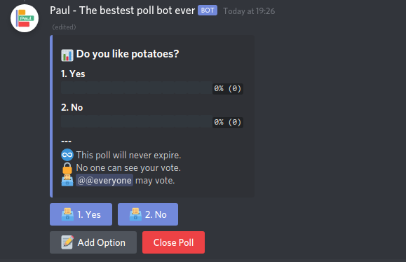
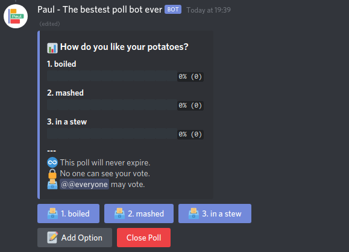
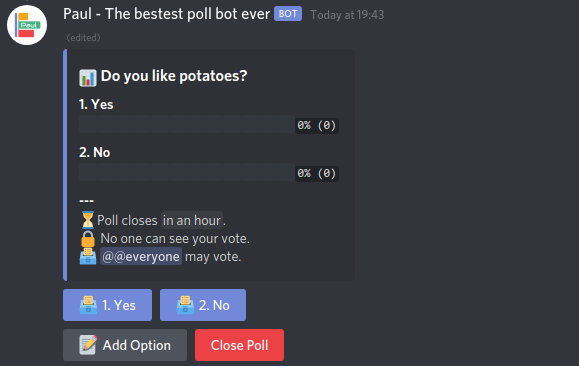
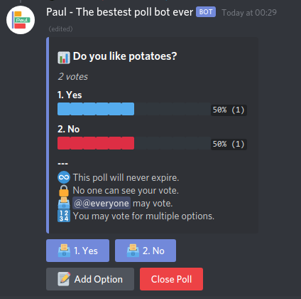

# Paul - The bestest polling bot ever

Hi! I'm Paul; a teeny tiny bot who's good at one thing. Making polls. And when I say good, I mean really really good. Like the bestest best bot ever at making polls. I can make open polls, I can make closed polls, I can make dynamically editable polls, and I can make them any size. And all that with a simple, good-looking, and easy to use interface! So come on and try me out in your server!

## Usage

This bot has a very simple interface. There is only one command. `/poll`. Below are the parameters it accepts.

### question

Specify the question that the poll is asking. This parameter is required.

> Example:
>
> `/poll question: Do you like potatoes?`
>
> 

### options

Choose which options will be available for people to vote for. This parameter is optional, and by default will be Yes/No.

When entering options, you must separate each option with a pipe character (`|`). (Trailing spaces around the pipe will be ignored.)

> Example:
>
> `/poll question: How do you like your potatoes? options: boiled | mashed | in a stew`
>
> 

### expires

With this parameter, you can choose when the poll will expire. Once the poll is expired, the vote buttons will disappear.

When entering the expiry date/time, you may be quite liberal in its format. You can enter a relative date/time, such as "in 2 minutes", "1h20m", "tomorrow", "next week", etc; or you can enter an absolute date/time, such as "5 PM", "26 oct 2022", etc.

When using an absolute time such as "5 PM", it will be treated as UTC time. To specify a time zone, just include it in your input, for example "5 PM GMT+3" or "5 PM EST"

> Example:
>
> `/poll question: Do you like potatoes? expires: 1h20m`
>
> 

### allow_multiple_votes

With this parameter you can control whether or not to allow people to vote on several different options. By default each voter may vote for only one option. If you set this to True, then each voter can vote for each option up to one time.

> Example:
>
> `/poll question: Do you like potatoes? allow_multiple_votes: True`
>
> 
